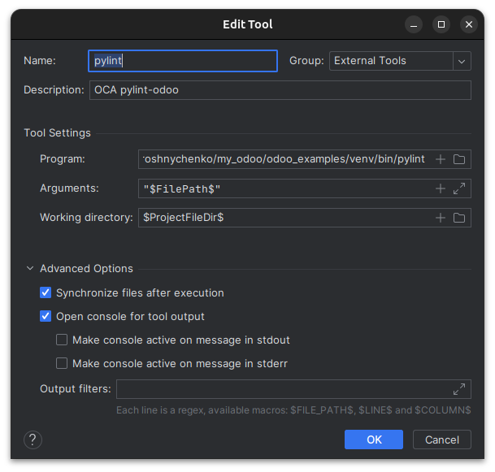

**pylint-odoo**

https://github.com/OCA/pylint-odoo

1. Установка в *venv*: `pip install pylint-odoo`
2. Запуск: `pylint --load-plugins=pylint_odoo -e odoolint path/to/test`
3. Додати до *External Tools* в *PyCharm*:
